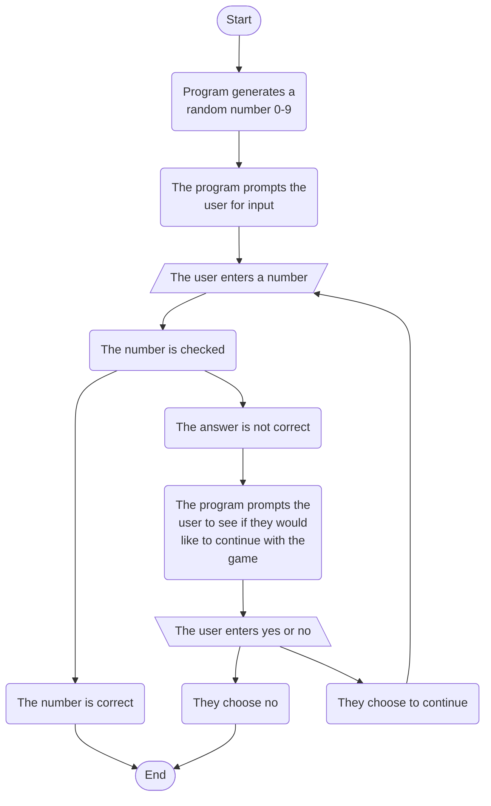

## Explanation:
So basically the thing starts with the program creating the number, 
then the person will be prompted for a number, 
they enter a number, 
the program checks to see if it's right, 
if it's right then the thing ends, 
if it isn't then they can either choose to continue or they can quit,
if they chose to quit then the thing ends, 
if they choose to continue then they go back to the point where they enter a number and the process repeats until they quit or guess the number correctly.